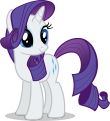

# Image to Text Converter
Convert any image into text created out of braille (2x4 dots) characters

## Example:

### Input

          
### Output

### Note
White Spaces will have differnet width according to the font. Set custom space character from the code file
